# NanoCore-S1 — Component Map

*Every roadmap component (1–47) placed on the architecture, numbered, and
status-colored. This is the bridge between `ROADMAP.md` (where numbers get
their definition + acceptance criteria) and `ARCHITECTURE-SYSTEM.md` (where the
shape gets its rationale). To tweak: edit the Mermaid source below — it's
plain text, it diffs, and it re-renders anywhere Mermaid runs.*

**Status colors**: green = BUILT/verified · amber = PARTIAL (exists, unverified
or half-shipped) · blue = DECIDED (ADR accepted) · purple = PROPOSED (gated
research) · gray = TODO.

```mermaid
flowchart TB
    classDef built fill:#1b5e20,stroke:#0d3c10,color:#fff
    classDef partial fill:#f9a825,stroke:#8a5800,color:#000
    classDef decided fill:#1565c0,stroke:#0a3a78,color:#fff
    classDef proposed fill:#6a1b9a,stroke:#3a0d55,color:#fff
    classDef todo fill:#9e9e9e,stroke:#555,color:#fff

    subgraph IN["INPUT → PERCEPTION"]
        n1["[1] StateEncoder — EG2 frozen"]
        n38["[38] composer factory"]
        n31["[31] agentic memory — composition half"]
    end

    subgraph CORE["DECIDE — the shipped path"]
        n7["[7] DecisionModel"]
        n6["[6] DecisionCache"]
        n2["[2] CosineScorer"]
        n3["[3] OrdinalScorer"]
        n4["[4] TaskHead"]
        n5["[5] ConformalGate<br/>+ SlowState (+37 set-size fix)"]
        n12["[12] clarify presenter"]
        n11["[11] escalation handler"]
    end

    subgraph REG["REGULATION — the slow layer"]
        n41["[41] glial regulator<br/>competence field over z"]
        n46["[46] recalibrate rung<br/>sustained shift → re-baseline"]
    end

    subgraph MEM["MEMORY / SELF-MODEL"]
        n14["[14] prediction log"]
        n42["[42] trajectory corpus<br/>+ outcome joins"]
        n47["[47] random-access<br/>semantic predictor"]
        n43["[43] transition head<br/>(shape superseded by 47)"]
    end

    subgraph OPS["OPS SHELL"]
        n9["[9] CLI"]
        n10["[10] adapt harness"]
        n8["[8] bundle save/load"]
        n13["[13] serve"]
        n15["[15] cost accounting"]
        n16["[16] ops monitor"]
        n17["[17] ML monitor"]
        n18["[18] drift detection"]
        n19["[19] uncertainty decomp"]
        n20["[20] retrain pipeline"]
        n21["[21] registry"]
        n22["[22] release<br/>shadow/canary/rollback"]
        n39["[39] package split<br/>agent-safety boundary"]
    end

    subgraph EVAL["EVALUATION SURFACE — Kaggle kernels"]
        n40["[40] Jev anchor"]
        n45["[45] s1_stimulus<br/>behavior streams"]
        n36["[36] typed-decisions leg"]
        n25["[25] bench breadth"]
        n26["[26] multimodal proof"]
        n27["[27] multilingual"]
        n23["[23] causal readout"]
        n24["[24] baselines"]
    end

    subgraph EXT["ECOSYSTEM / DELIVERY"]
        n44["[44] OLC6 container"]
        n29["[29] llama.cpp parity<br/>device latency"]
        n30["[30] harness contract"]
        n34["[34] rich question schema"]
        n35["[35] Jev endpoint"]
        n28["[28] numeric refine loop"]
        n33["[33] responsible design"]
        n32["[32] runbook"]
    end

    raw([items — text/code/image/audio]) --> n1
    n1 --> n38
    n38 -- "z (multi-item state)" --> n7
    n31 -.-> n38
    n7 --> n6
    n7 --> n2 & n3 & n4
    n2 & n3 & n4 -- "score rows" --> n5
    n5 -- "Prediction {answer|clarify|escalate}" --> n14
    n5 -- "clarify" --> n12
    n5 -- "escalate" --> n11

    n14 --> n42
    n42 --> n41 & n46 & n47
    n41 -. "conditions / modulates" .-> n5
    n46 -. "candidate thresholds (qualify-then-adopt)" .-> n5
    n47 -. "deliberative dispatch p(z'|z,do(a))" .-> n5
    n43 -.-> n47

    n10 -- "labeled data → fitted head+gate" --> n8
    n9 --> n10 & n13
    n8 --> n13 --> n7
    n13 --> n15 & n16 & n17
    n14 --> n17
    n16 --> n18
    n21 -. "lineage" .-> n8
    n22 -. "adopts / rolls back" .-> n8
    n20 -. "reads corpus" .-> n42
    n45 & n40 -. "mounts qualified bundle (no rebuild)" .-> n8
    n23 & n24 & n25 & n26 & n27 & n36 -. "eval legs read artifacts" .-> n8
    n28 -. "refines" .-> n3
    n34 -. "richer options" .-> n7
    n35 -. "serving shape" .-> n13
    n44 -. "seals + ships" .-> n8
    n29 -. "on-device backend" .-> n1
    n30 -. "binds" .-> n28 & n31 & n33
    n19 -. "offline instrument" .-> n14
    n39 -. "import-reach boundary" .-> CORE
    n32 -. "operates" .-> OPS

    class n1,n2,n3,n4,n5,n6,n7,n8,n9,n10,n11,n12,n13,n14,n15,n16,n17,n18,n19,n21,n22 built
    class n20,n28,n33,n40,n42,n44 partial
    class n41 decided
    class n43,n47 proposed
    class n23,n24,n25,n26,n27,n29,n30,n31,n32,n34,n35,n36,n38,n39,n45,n46 todo
```

## Reading it

- **The spine** runs top-to-bottom: `items → [1] encode → [38] compose →
  [7] decide → [2-4] score → [5] gate → Prediction → [14] log → [42] corpus`.
- **The loop** is the rightward return edge: `[42] → {41, 46, 47} → back into
  [5]` — everything learned hangs off the corpus. Dotted arrows are
  unbuilt conditioning channels.
- **43→47**: the transition head's planned shape was superseded — `p(z'|z,a)`
  becomes the random-access/maskable predictor (PSI finding); 47 is the build
  target, 43 stays as the framing.
- **37 shipped inside 5** — shown as an annotation on the gate, not a node;
  it was a fix, not a standalone box.
- **Gray clusters are the frontier**: composer factory (38), stimulus surface
  (45), recalibrate rung (46), package split (39) — all spec'd, all gated on
  the corpus or a qualified bundle.

## Component index

| # | Component | Layer | Status | Anchor |
|---|---|---|---|---|
| 1 | StateEncoder | IN | BUILT | `encoder.py` |
| 2–4 | scorers | CORE | BUILT | `scoring.py` |
| 5 | ConformalGate (+37) | CORE | BUILT | `gate.py`, `slow.py` |
| 6 | DecisionCache | CORE | BUILT | `cache.py` |
| 7 | DecisionModel | CORE | BUILT | `model.py` |
| 8 | bundle | OPS | BUILT | `model.save/load` |
| 9 | CLI | OPS | BUILT | `cli.py` |
| 10 | adapt | OPS | BUILT | `adapt.py` |
| 11–12 | handlers | CORE | BUILT | `handlers.py` |
| 13–19 | serve/log/cost/monitor/drift/uncertainty | OPS | BUILT | `serve.py`, `monitor.py`, `uncertainty.py` |
| 20 | retrain pipeline | OPS | PARTIAL | `adapt.py` + cadence TODO |
| 21–22 | registry + release | OPS | BUILT | `registry.py`, `canary.py` |
| 23–27 | causal/baselines/breadth/multimodal/multilingual | EVAL | TODO | kernel legs |
| 28 | numeric refinement | EXT | PARTIAL | `OrdinalScorer.expected` done; loop TODO |
| 29 | llama.cpp parity | EXT | TODO | Phase 8, owner-triggered |
| 30 | harness contract | EXT | TODO | binds 28/31/33 |
| 31 | agentic memory | IN | TODO | composition half done |
| 32–33 | runbook / responsible design | EXT | TODO / PARTIAL | `RUNBOOK.md`, `modelcard.py` |
| 34–35 | rich schema / Jev endpoint | EXT | TODO | serving shape |
| 36 | typed-decisions leg | EVAL | TODO | eval anchor |
| 38 | composer factory | IN | TODO | E4 structural blocker |
| 39 | package split | OPS | TODO | import reach = safety |
| 40 | Jev anchor | EVAL | PARTIAL | code done, ran v27 |
| 41 | glial regulator | REG | DECIDED | ADR-0014; prereq 42 |
| 42 | trajectory corpus | MEM | PARTIAL | first rows v27; `TRAJECTORY-LOGGING.md` |
| 43 | transition head | MEM | PROPOSED | ADR-0015; shape → 47 |
| 44 | OLC6 container | EXT | PARTIAL | prototype; `prototypes/olc-container/` |
| 45 | s1_stimulus | EVAL | TODO | `EVAL-SURFACE.md`; mounts qualified bundle |
| 46 | recalibrate rung | REG | TODO | third response mode; prereq 42 |
| 47 | random-access predictor | MEM | PROPOSED | `recursive-structure.md`; PSI/TRM |

*If a number here disagrees with `ROADMAP.md`, the roadmap wins — update this
map, not the source of truth.*
